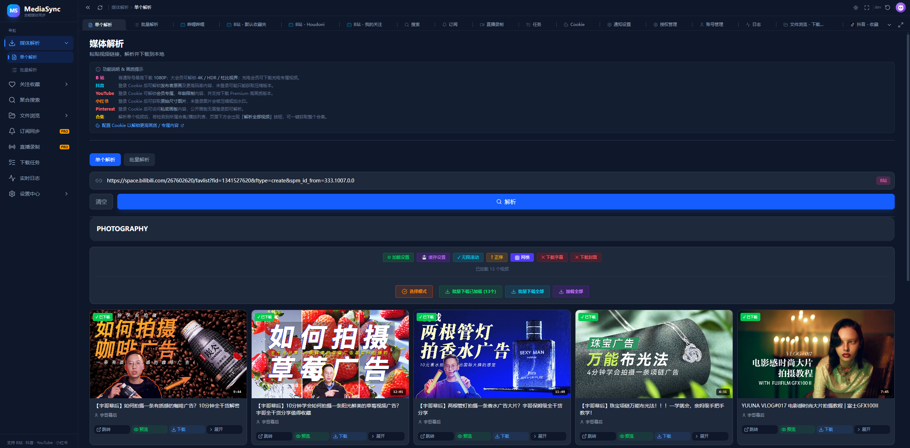
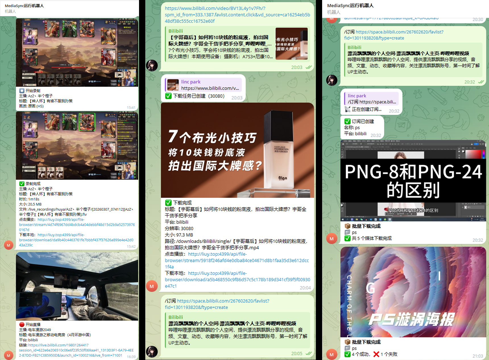
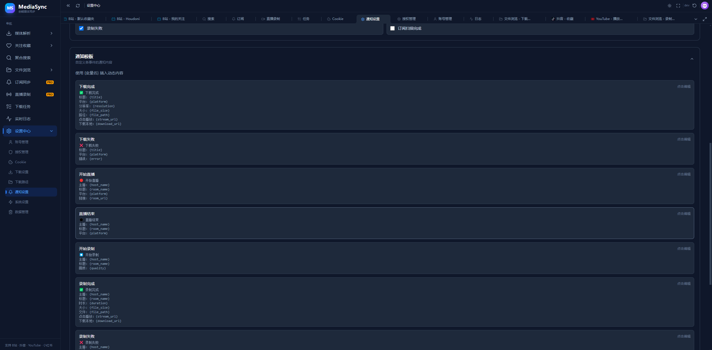

<h1 align="center">MediaSync</h1>

<p align="center"><strong>从发现、下载到自动归档，一站管理你的媒体收藏。</strong></p>
<p align="center">多平台媒体解析 · 批量下载 · 订阅同步 · 直播录制 · 文件管理</p>

<p align="center">
  <a href="#界面与功能">界面与功能</a> ·
  <a href="#支持平台">支持平台</a> ·
  <a href="#快速开始">快速开始</a> ·
  <a href="#首次使用">首次使用</a> ·
  <a href="#使用文档">使用文档</a> ·
  <a href="#常见问题">常见问题</a>
</p>

<p align="center">
  
  
  
</p>

MediaSync 是面向个人媒体收藏与素材归档的工具。粘贴链接即可解析视频、音频、图片或合集，选择画质后保存到浏览器所在设备，也可以交给 NAS / 服务器持续下载。通过关注收藏、聚合搜索、订阅同步和直播录制，把内容发现、保存与浏览放在同一个界面里。

支持 Windows 桌面版与 Docker 部署，提供适配电脑和手机的 Web UI、多标签页和实时任务状态。


## 支持平台

以下按当前实现列出主要能力；不同平台支持的内容类型并不完全相同，实际可下载格式取决于来源、登录权限及平台返回结果。

| 平台 / 来源 | 主要支持内容 |
|:---|:---|
| Bilibili | 单个视频、分 P、合集 / 系列、收藏夹、稍后再看、UP 主投稿与关注；字幕、封面、ASS 弹幕 |
| YouTube | 视频、Shorts、播放列表、频道与喜欢的视频；按可用格式选择画质和音频 |
| 抖音 | 视频、图集、实况图片、用户作品、喜欢、收藏、关注、合集 / 系列 |
| 小红书 | 笔记视频、图片、实况图片、收藏内容；评论区图片解析与批量下载 |
| Twitter / X | 推文视频、单图 / 多图原图、用户主页、喜欢与书签；视频保留或合并原音轨 |
| Instagram | 帖子图片与视频、Reels、Stories |
| Pinterest | Pin、画板解析与批量下载 |
| 微博 | 帖子图片、视频和实况图片；实况图片与 MP4 按相同编号保存 |
| 微信视频号 | 支持的分享链接解析；需要在 Cookie 设置中配置腾讯元宝登录态 |
| 微信公众号 | 文章正文中的图片与可获取的视频媒体 |
| Telegram | 有用户名的频道 / 超级群组及消息链接中的图片、相册；支持公开网页解析和账号登录后获取照片 |
| 新片场 | 作品视频解析与格式选择，支持平台 Cookie 登录 |
| 优酷 / 爱奇艺 / 腾讯视频 / 央视频 | 账号权限范围内、解析器可获取且未受 DRM 保护的媒体，具体以解析结果为准 |
| 公开作品网页 | Behance、ManvsMachine、FRAME、XK Studio、Squarespace 等页面的图片、GIF、内嵌与背景视频 |
| 通用媒体链接 | 支持的媒体直链、M3U8 / MPD 与其他可被解析器识别的网页 |

## 界面与功能

### 解析与批量下载

- **单个链接与批量链接**：解析视频、图文、播放列表、收藏夹和合集，预览后选择需要保存的内容。
- **画质与格式选择**：按来源提供的格式选择清晰度；支持的视频可同时下载字幕、封面，B 站视频还可保存 ASS 弹幕。
- **本地与服务器下载**：本地下载保存到浏览器所在设备，服务器下载由后台队列执行，适合 NAS 长期运行。
- **图文混合内容**：支持图片、GIF 与视频混合的作品页；支持的平台实况照片会同时保存图片和对应 MP4。
- **批量选择与去重**：合集按需勾选、批量加入任务，结合下载记录跳过已下载内容。


<details>
<summary>查看合集解析界面</summary>



</details>

### 关注收藏与聚合搜索

在应用内浏览 B 站收藏夹、稍后再看、关注 UP 主，抖音收藏、喜欢与关注，YouTube 播放列表与关注频道，以及小红书收藏内容。可从列表继续解析下载，或为支持的来源创建订阅。

聚合搜索支持 **Bilibili、YouTube、抖音**，按平台与视频、UP 主 / 频道、合集 / 播放列表筛选，并从结果进入预览、下载或订阅。


<details>
<summary>查看我的关注界面</summary>


</details>

### 订阅同步 · PRO

将支持的 UP 主、频道、收藏夹、播放列表、合集或画板加入订阅，定时检查更新并自动下载。

- 从链接、关注收藏或搜索结果创建订阅。
- 快速扫描近期内容，深度扫描补齐历史内容；支持增量扫描与扫描数量、间隔配置。
- 查看扫描进度、新增条目与下载记录，暂停、恢复或批量管理订阅。
- 配置下载策略与并发限制，删除订阅时可选择保留历史记录。


### 直播监控与录制 · PRO

添加直播间后监控开播状态，自动开始录制，并集中管理录制文件、历史记录与日志。

- 支持 Bilibili、抖音、虎牙、斗鱼、Twitch、YY、网易 CC、AcFun、微博、小红书等直播平台。
- 录制参数可按全局、平台、房间分别配置，选择画质、保存目录和文件名模板。
- 按时长或文件大小分段，支持仅录音频，以及录制后的 FLV 修复、MP4 转换和封面提取。
- 支持开播与录制事件通知，以及录制后上传到 WebDAV。


### 下载任务与文件浏览

下载任务集中显示进度、速度和状态，支持暂停、恢复、取消与失败重试。实时日志用于查看解析、扫描和下载过程中的问题。

内置文件浏览器可访问下载目录和录制目录，支持目录搜索、视频播放、图片预览、文件下载、文件夹打包与删除。


### 通知与远程操作

通过 **Telegram Bot / 企业微信**接收下载、订阅和直播录制相关通知，可按事件选择通知内容并自定义模板。配置渠道与命令接收后，可从聊天窗口触发解析、下载、订阅或查看状态。

| 常用命令 | 用途 |
|:---|:---|
| `/analyze <链接>` | 解析媒体链接 |
| `/download <链接>` | 发起下载 |
| `/subscribe <链接>` | 为支持的来源创建订阅 |
| `/status` | 查看运行状态 |
| `/help` | 查看机器人帮助 |



<details>
<summary>查看通知模板设置</summary>



</details>

### 设置、备份与归档规则

| 功能 | 可以做什么 |
|:---|:---|
| 平台登录 | B 站扫码、多平台浏览器登录与 Cookie 导入；Telegram 账号独立扫码登录 |
| 代理设置 | 配置 HTTP / HTTPS / SOCKS 代理，按平台网络需求使用 |
| 下载路径与文件名 | 使用平台、作者、合集、标题、日期等变量组织目录与文件名；配置重名处理策略 |
| 附属文件归档 | 将视频与字幕、ASS 弹幕、封面放入同一子文件夹 |
| 风控管理 | 调整下载并发、分块、扫描间隔、请求速率及 B 站延迟与重试参数 |
| 数据同步 | 按类别导入、导出设置、Cookie、订阅、录制和通知数据；支持 WebDAV 备份、恢复与定时备份 |
| 账号与版本 | 管理应用账号、查看授权状态、检查版本更新 |


## 快速开始

### Windows 桌面版

1. 前往 [GitHub Releases](https://github.com/lincolnpark2000/MediaSync/releases)，下载对应版本的 `MediaSync-Setup-*.exe`。
2. 安装并启动 MediaSync，按首次运行提示完成设置。
3. 设置保存目录，并按需配置平台登录与代理。

### Docker / NAS 部署

新建 `compose.yaml`，使用下面的配置。相对目录会保存在该配置文件所在目录下；NAS 上也可替换成自己的绝对路径。

```yaml
services:
  mediasync:
    image: lincolnpark2000/mediasync:latest
    container_name: mediasync
    restart: unless-stopped
    ports:
      - "4399:3000"
    volumes:
      - ./downloads:/downloads
      - ./data:/app/data
      - ./live_recordings:/live_recordings
    environment:
      MEDIASYNC_DATA_DIR: /app/data
      BACKEND_URL: http://localhost:9000
      # ALL_PROXY: http://你的代理地址:端口
```

在配置文件所在目录启动：

```bash
docker compose -f compose.yaml up -d
```

访问 **`http://localhost:4399`**，远程访问时将 `localhost` 换成服务器或 NAS 的 IP。前端会代理后端请求，无需另外映射后端的 `9000` 端口。

启动后，在「设置中心 → 下载路径」中将下载目录设为 `/downloads`，在直播录制设置中将录制目录设为 `/live_recordings`，使文件写入对应挂载目录。

| 容器路径 | 保存内容 |
|:---|:---|
| `/downloads` | 下载的视频、音频、图片及附属文件 |
| `/app/data` | 配置、登录信息、订阅数据库、缓存与其他运行数据 |
| `/live_recordings` | 使用上述录制目录时保存的直播文件 |

更新、查看日志与停止：

```bash
# 更新镜像并重建容器，保留已挂载的数据
docker compose -f compose.yaml pull
docker compose -f compose.yaml up -d

# 查看日志
docker compose -f compose.yaml logs -f

# 停止并移除容器
docker compose -f compose.yaml down
```

> 从源码构建时使用仓库的 `docker-compose.mediasync.yml`，先将其中的宿主机挂载路径改为自己的目录，再执行 `docker compose -f docker-compose.mediasync.yml up -d --build`。仓库根目录的 `docker-compose.yml` 目前仅含说明，不能直接用于启动。

详细步骤见 [Windows Docker 安装指南](./guides/install-windows.md) 与 [NAS 部署指南](./guides/install-nas.md)。

### 源码本地运行

需要 Python 3.11+、Node.js 20+ 和可从命令行调用的 FFmpeg。Windows 可在源码目录双击 `start.bat`，脚本会检查依赖并启动服务；默认前端为 **`http://localhost:3100`**，后端为 **`http://localhost:8000`**。

<details>
<summary>手动启动前后端</summary>

在项目根目录创建并激活 Python 虚拟环境：

```bash
python -m venv .venv
```

Windows PowerShell：

```powershell
.\.venv\Scripts\Activate.ps1
```

macOS / Linux：

```bash
source .venv/bin/activate
```

启动后端：

```bash
pip install -r backend/requirements.txt
cd backend
python -m uvicorn main:app --host 0.0.0.0 --port 8000
```

另开终端，从项目根目录启动前端：

```bash
cd frontend
npm ci
npm run dev
```

前端开发模式默认代理到 `http://localhost:8000`。如修改后端端口，请同步设置前端的 `BACKEND_URL`。浏览器登录功能还需要可用的 Chrome / Chromium 浏览器环境。

</details>

## 首次使用

1. **配置存储**：在「设置中心 → 下载路径」设置目录、文件名模板和默认下载位置。Docker 内填写容器路径。
2. **登录平台**：在「设置中心 → Cookie」按平台扫码、浏览器登录或导入 Cookie；受限列表与高清内容需要对应账号权限。
3. **配置网络**：需要代理的平台，在「设置中心 → 代理设置」配置可从运行 MediaSync 的设备访问的代理地址。
4. **试下一个链接**：进入「媒体解析 → 单个解析」，预览并选择画质，下载到本地或服务器。
5. **按需自动化**：创建订阅、添加直播间，并在「通知设置」配置消息渠道；使用「数据同步」备份配置。

## 使用文档

| 文档 | 内容 |
|:---|:---|
| [下载功能详解](./guides/download-guide.md) | 单个 / 批量解析、格式选择与任务管理 |
| [关注收藏](./guides/favorites-guide.md) | 收藏夹、关注列表与内容浏览 |
| [聚合搜索](./guides/search-guide.md) | 跨平台搜索、筛选与结果操作 |
| [订阅同步](./guides/subscription-guide.md) | 创建订阅、扫描策略与自动下载 |
| [直播录制](./guides/live-recorder-guide.md) | 房间监控、录制设置与文件管理 |
| [文件管理](./guides/file-browser-guide.md) | 文件浏览、预览、播放与下载 |
| [Cookie 与登录](./guides/cookie-guide.md) | 各平台登录与 Cookie 配置 |
| [Telegram 图片与账号登录](./guides/telegram-images.md) | 图片解析、扫码登录与支持范围 |
| [通知与机器人](./guides/notification-guide.md) | Telegram / 企业微信及远程命令 |
| [系统设置](./guides/settings-guide.md) | 路径、下载与其他设置 |
| [B 站防风控](./guides/anti-risk-guide.md) | 请求速率、重试与风控参数 |
| [常见问题](./guides/faq.md) | 安装、登录、网络与下载排错 |

## 常见问题

<details>
<summary>下载到本地和下载到服务器有什么区别？</summary>

本地下载最终保存到当前浏览器所在的电脑或手机；服务器下载保存到运行 MediaSync 的设备，并可在「下载任务」与「文件浏览」中管理。需要后台合并或处理的内容，本地下载也可能先由服务器生成文件。

</details>

<details>
<summary>容器运行后页面打不开，或页面能打开但解析失败？</summary>

先确认容器状态、端口映射与防火墙是否允许访问 `4399`，再查看容器日志。页面能打开但 API 请求失败时，检查 `BACKEND_URL` 是否指向容器内的 `http://localhost:9000`。本地源码开发则默认使用 `3100 / 8000`，与 Docker 端口不同。

</details>

<details>
<summary>为什么解析结果缺少内容、高清画质不可用，或提示 403 / 412？</summary>

先检查平台 Cookie 是否有效、账号能否访问原内容，以及代理是否可用。B 站风控可通过降低并发、增加请求间隔缓解；字幕仅下载来源实际提供的内容，默认优先原始 / 默认语言与简体中文，最多两种语言。平台的会员权限、地区限制和资源可用性仍然适用。

</details>

<details>
<summary>如何迁移或备份？升级会丢数据吗？</summary>

保留并备份宿主机上挂载的 `data`、`downloads`、`live_recordings` 目录，重建容器时继续使用相同挂载路径。设置中的本地导出和 WebDAV 备份用于所选类别的配置与记录，不等同于完整媒体文件备份；Telegram 账号会话不包含在普通配置导出中。

</details>

<details>
<summary>为什么代理在本机可用，容器里却连接失败？</summary>

容器中的 `127.0.0.1` 指向容器自身。填写能从容器访问的宿主机或局域网代理地址，并确认代理允许相应连接。

</details>

## 技术栈

| 部分 | 技术 |
|:---|:---|
| 前端 | Next.js 16、React 19、TypeScript、Tailwind CSS 4 |
| 后端 | FastAPI、yt-dlp、f2 与各平台解析模块 |
| 媒体处理 | FFmpeg、字幕处理与 B 站 ASS 弹幕转换 |
| 数据与通知 | SQLite、WebSocket、Telegram Bot、企业微信、WebDAV |
| 部署 | Docker 多阶段构建、Windows 桌面安装包 |

## 使用说明

请仅下载和保存自己创作、获授权或依法可使用的内容，并遵守来源平台的使用规则。媒体版权归原作者或权利人所有；平台接口与访问策略变化可能影响部分功能。
