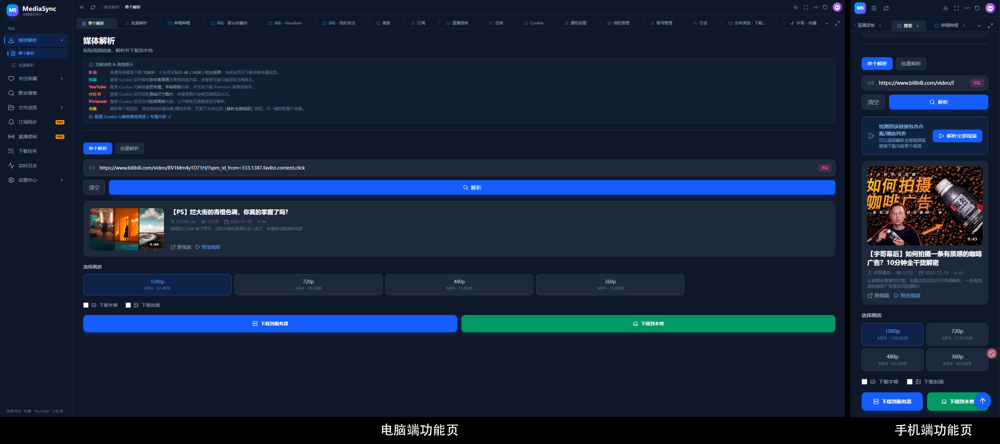
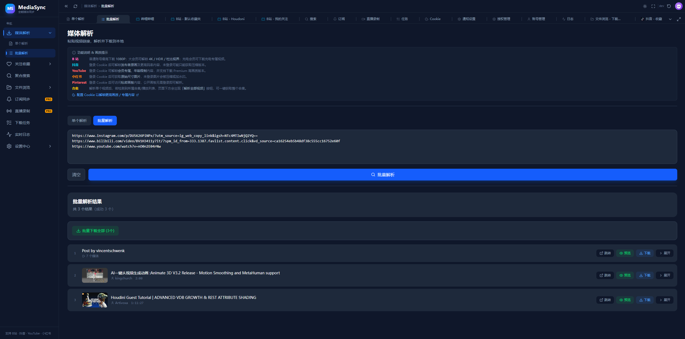
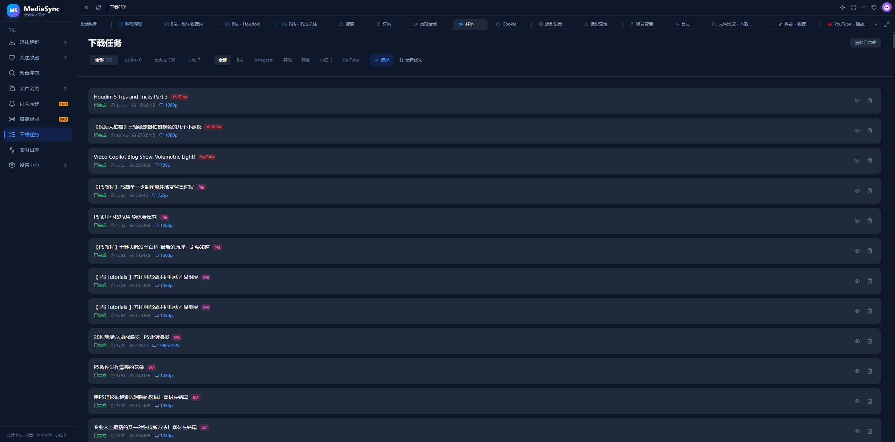
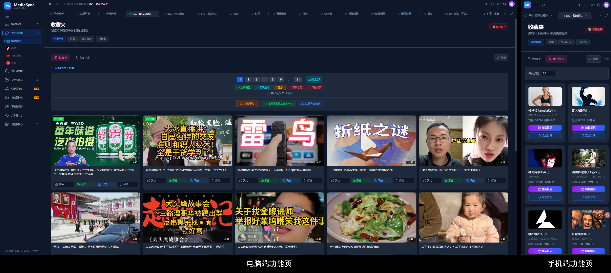
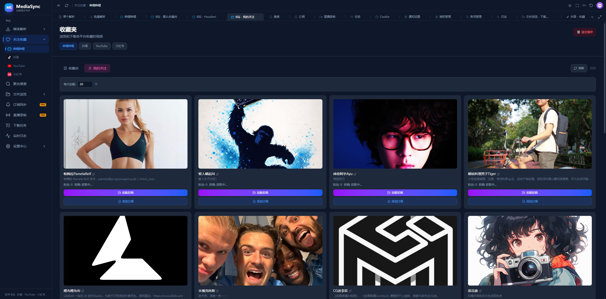
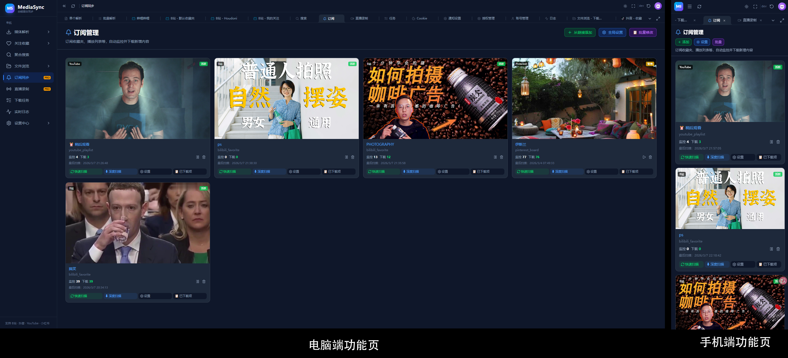
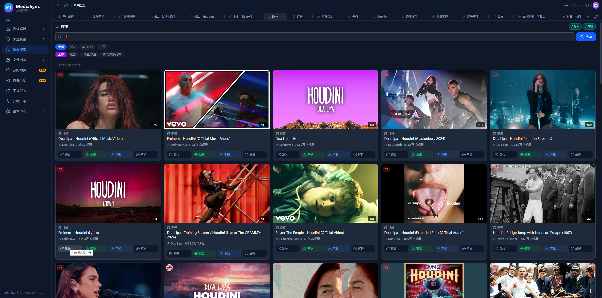
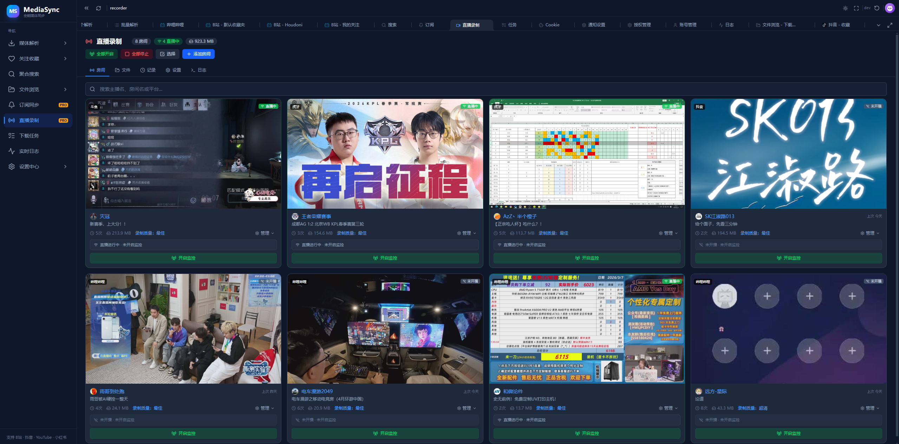
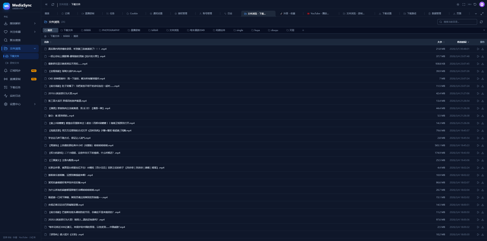

<h1 align="center">MediaSync</h1>

<p align="center">
  <strong>一站式多平台媒体内容管理与下载工具</strong>
</p>

<p align="center">
  <a href="#-支持平台">支持平台</a> •
  <a href="#-核心功能">核心功能</a> •
  <a href="#-快速开始">快速开始</a> •
  <a href="#-安装部署">安装部署</a> •
  <a href="#-使用文档">使用文档</a> •
  <a href="#-常见问题">常见问题</a>
</p>

<p align="center">
  
  
  
</p>

---

## 📖 项目简介

**MediaSync** 是一款基于 Web UI 的多平台媒体内容下载与管理工具，支持 **YouTube、Bilibili（B站）、抖音、小红书、Twitter/X、Instagram、Pinterest** 等主流平台。通过统一的界面，你可以浏览收藏夹、关注列表，一键或批量下载视频/图片，还能创建订阅自动追踪并下载新内容。

项目采用 **Docker 一键部署**，特别适合在 **NAS（群晖 / 威联通 / 极空间等）** 和 **Windows Desktop** 环境中运行。

<!-- 后续在此处添加主界面截图 -->
<!-- <p align="center"></p> -->

---

## 🌐 支持平台

| 平台 | 视频下载 | 收藏/关注浏览 | 订阅追踪 | 搜索 | 登录方式 |
|:---:|:---:|:---:|:---:|:---:|:---:|
| **YouTube** | ✅ | ✅ | ✅ | ✅ | Cookie 导入 |
| **Bilibili** | ✅ | ✅ | ✅ | ✅ | 扫码登录 / Cookie |
| **抖音** | ✅ | ✅ | ✅ | ✅ | Cookie 导入 |
| **小红书** | ✅ | ✅ | ✅ | — | Cookie 导入 |
| **Twitter/X** | ✅ | — | — | — | Cookie 导入 |
| **Instagram** | ✅ | — | — | — | Cookie 导入 |
| **Pinterest** | ✅ | ✅ | — | — | Cookie 导入 |

> 📌 各平台的详细登录方法和 Cookie 获取教程，请参阅 👉 [Cookie 与登录指南](./guides/cookie-guide.md)

---

## ✨ 核心功能

### 🎬 媒体解析与下载

> 详细使用教程请参阅 👉 [下载功能详解](./guides/download-guide.md)

- **单个 / 批量 URL 解析** — 粘贴链接即可自动识别平台并解析
- **格式自由选择** — 支持分辨率、编码格式、音频格式等多种选项
- **实时下载进度** — WebSocket 推送实时速度、进度和预计完成时间
- **暂停 / 恢复 / 取消** — 全面的下载任务控制
- **批量操作** — 选中多个任务一键暂停、恢复或取消
- **速度限制** — 可配置单任务及全局下载速度上限

<p align="center"></p>

<p align="center"></p>

<p align="center"></p>

### ❤️ 收藏 / 关注列表浏览

> 详细使用教程请参阅 👉 [收藏与关注功能详解](./guides/favorites-guide.md)

- **B站** — 收藏夹列表、稍后再看、关注 UP 主、合集 / 系列
- **YouTube** — 播放列表、关注频道、喜欢的视频
- **抖音** — 收藏列表、关注博主、合集 / 系列
- **小红书** — 收藏笔记
- **Pinterest** — 画板浏览
- 支持在列表中直接选择并批量下载

<p align="center"></p>

<p align="center"></p>

### 🔔 订阅追踪

> 详细使用教程请参阅 👉 [订阅功能详解](./guides/subscription-guide.md)

- **自动追踪更新** — 订阅关注的 UP 主 / 频道 / 收藏夹，自动检测新内容
- **自动下载** — 检测到新内容后自动加入下载队列
- **增量扫描** — 智能识别已处理内容，避免重复下载
- **灵活配置** — 自定义扫描间隔、下载数量上限等
- **状态面板** — 一目了然地查看所有订阅状态和下载统计

<p align="center"></p>

### 🔍 聚合搜索

> 详细使用教程请参阅 👉 [搜索功能详解](./guides/search-guide.md)

- 统一搜索界面，同时搜索 Bilibili、YouTube、抖音
- 结果分类展示：视频、频道 / 创作者、播放列表
- 搜索结果可直接下载或创建订阅

<p align="center"></p>

### 📻 直播录制

> 详细使用教程请参阅 👉 [直播录制详解](./guides/live-recorder-guide.md)

- 支持 Bilibili 直播、YouTube 直播等平台
- 自动监控与手动录制
- 画质选择与文件分段保存
- 录制文件管理与回放

<p align="center"></p>

### 📁 文件管理

> 详细使用教程请参阅 👉 [文件管理详解](./guides/file-browser-guide.md)

- 内置文件浏览器，直接管理下载的视频和录制文件
- 在线视频播放预览（基于 ArtPlayer）
- 图片预览、文件搜索、排序
- 支持文件夹打包下载

<p align="center"></p>

### 🛡️ B站防风控

> 详细配置教程请参阅 👉 [防风控配置指南](./guides/anti-risk-guide.md)

- 智能请求频率控制，避免触发 B 站风控
- 内置多种预设方案（快速 / 标准 / 安全 / 极端安全）
- 动态请求头轮换
- 风控状态实时监测

### 🔔 通知系统

> 详细配置教程请参阅 👉 [通知系统详解](./guides/settings-guide.md#通知系统)

- **多通道支持** — Telegram Bot、企业微信等
- **事件触发** — 下载完成、下载失败、直播开始、录制完成等
- **交互式操作** — 通过 Telegram Bot 或企业微信接收通知，支持发送命令控制任务
- **自定义模板** — 自定义通知消息内容和格式
- **媒体附件** — 通知中可附加视频缩略图或预览

### ⚙️ 系统设置

> 详细配置教程请参阅 👉 [系统设置详解](./guides/settings-guide.md)

- **下载设置** — 格式、画质、命名模板、并发数
- **路径设置** — 自定义下载保存路径
- **通知系统** — Telegram Bot、企业微信等多种通知渠道
- **缓存管理** — 一键清理各类缓存数据
- **暗色 / 亮色主题** — 自由切换

---

## 🛠️ 技术栈

| 组件 | 技术 |
|:---|:---|
| 前端 | Next.js 16 + React 19 + TypeScript + Tailwind CSS |
| 后端 | FastAPI + Python 3.13 |
| 下载引擎 | yt-dlp |
| 浏览器自动化 | Playwright + Chromium |
| 视频处理 | FFmpeg |
| 容器化 | Docker（多阶段构建） |

---

## 🚀 快速开始

MediaSync 通过 Docker 部署，只需要 **一个命令** 即可运行：

```bash
docker run -d \
  --name mediasync \
  --restart unless-stopped \
  -p 4399:3000 \
  -v /path/to/downloads:/downloads \
  -v /path/to/data:/app/data \
  -e MEDIASYNC_DATA_DIR="/app/data" \
  -e BACKEND_URL="http://localhost:9000" \
  mediasync:latest
```

启动后访问 `http://你的IP:4399` 即可打开 Web UI。

> 💡 需要更详细的安装步骤？请继续阅读下方 [安装部署](#-安装部署) 章节。

---

## 📦 安装部署

### 前置要求

- **Docker** 已安装并正在运行
- 至少 **2GB** 可用磁盘空间（镜像大小）
- 建议预留足够的存储空间用于下载文件

---

### 方式一：Windows Docker Desktop 安装

> 👉 附图文详细教程：[Windows Docker Desktop 安装指南](./guides/install-windows.md)

#### 1. 安装 Docker Desktop

从 [Docker 官网](https://www.docker.com/products/docker-desktop/) 下载并安装 Docker Desktop for Windows。安装完成后确保 Docker 引擎正在运行（系统托盘可看到 Docker 图标）。

#### 2. 拉取镜像

打开 **PowerShell** 或 **命令提示符**，执行：

```powershell
docker pull mediasync:latest
```

#### 3. 创建数据目录

为下载文件和配置数据创建本地目录：

```powershell
# 创建下载目录和数据目录（路径可自定义）
mkdir D:\MediaSync\downloads
mkdir D:\MediaSync\data
```

#### 4. 启动容器

```powershell
docker run -d `
  --name mediasync `
  --restart unless-stopped `
  -p 4399:3000 `
  -v D:\MediaSync\downloads:/downloads `
  -v D:\MediaSync\data:/app/data `
  -e MEDIASYNC_DATA_DIR="/app/data" `
  -e BACKEND_URL="http://localhost:9000" `
  mediasync:latest
```

#### 5. 访问 Web UI

打开浏览器，访问：

```
http://localhost:4399
```

#### 可选：配置代理

如果需要访问 YouTube 等海外平台，可在启动时添加代理环境变量：

```powershell
docker run -d `
  --name mediasync `
  --restart unless-stopped `
  -p 4399:3000 `
  -v D:\MediaSync\downloads:/downloads `
  -v D:\MediaSync\data:/app/data `
  -e MEDIASYNC_DATA_DIR="/app/data" `
  -e BACKEND_URL="http://localhost:9000" `
  -e ALL_PROXY="http://你的代理地址:端口" `
  mediasync:latest
```

> 💡 代理也可以在 Web UI 的 **设置 → 下载设置** 中配置。

---

### 方式二：NAS Docker Compose 安装

> 👉 附图文详细教程：[NAS Docker Compose 安装指南](./guides/install-nas.md)

适用于群晖（Synology）、威联通（QNAP）、极空间、绿联等支持 Docker 的 NAS 设备。

#### 1. 创建目录结构

在 NAS 上创建以下目录（路径根据你的 NAS 调整）：

```bash
# 群晖示例路径
mkdir -p /volume1/docker/mediasync/downloads
mkdir -p /volume1/docker/mediasync/data
mkdir -p /volume1/docker/mediasync/live_recordings
```

#### 2. 创建 docker-compose.yml

在 `/volume1/docker/mediasync/` 目录下创建 `docker-compose.yml` 文件：

```yaml
services:
  mediasync:
    image: mediasync:latest
    container_name: mediasync
    restart: unless-stopped
    ports:
      - "4399:3000"        # Web UI 访问端口
    volumes:
      # 下载文件存储路径
      - /volume1/docker/mediasync/downloads:/downloads
      # 配置文件和 Cookie 数据持久化
      - /volume1/docker/mediasync/data:/app/data
      # 直播录制文件存储（可选）
      - /volume1/docker/mediasync/live_recordings:/live_recordings
    environment:
      MEDIASYNC_DATA_DIR: "/app/data"
      BACKEND_URL: "http://localhost:9000"
      # 代理设置（可选，用于访问 YouTube 等海外平台）
      # ALL_PROXY: "http://你的代理地址:端口"
    healthcheck:
      test: ["CMD", "curl", "-f", "http://localhost:3000"]
      interval: 30s
      timeout: 10s
      retries: 3
      start_period: 40s
```

#### 3. 启动服务

通过 SSH 连接 NAS，或在 NAS 的 Docker 管理界面中导入配置：

```bash
cd /volume1/docker/mediasync
docker compose up -d
```

#### 4. 访问 Web UI

打开浏览器，访问：

```
http://NAS的IP地址:4399
```

#### 目录挂载说明

| 容器路径 | 用途 | 必须 |
|:---|:---|:---:|
| `/downloads` | 下载的视频 / 音频文件 | ✅ |
| `/app/data` | Cookie、配置文件、缓存数据 | ✅ |
| `/live_recordings` | 直播录制文件 | 可选 |

> ⚠️ **重要提示**：`/app/data` 目录包含你的登录 Cookie 和所有配置，务必做好目录映射，否则容器重启后将丢失登录状态。

#### 端口说明

| 端口 | 用途 |
|:---|:---|
| `3000`（容器内） | Web UI 前端服务 |
| `9000`（容器内） | 后端 API 服务（已通过前端代理，无需单独暴露） |
| `4399`（宿主机） | 映射端口，可自定义修改 |

---

### 环境变量参考

| 变量名 | 说明 | 默认值 |
|:---|:---|:---|
| `MEDIASYNC_DATA_DIR` | 数据文件存储路径 | `/app/data` |
| `BACKEND_URL` | 后端 API 地址 | `http://localhost:9000` |
| `ALL_PROXY` | 全局代理地址（可选） | — |
| `HTTP_PROXY` | HTTP 代理（可选） | — |
| `HTTPS_PROXY` | HTTPS 代理（可选） | — |

---

### 更新升级

```bash
# 1. 拉取最新镜像
docker pull mediasync:latest

# 2. 停止并删除旧容器（数据不会丢失）
docker stop mediasync
docker rm mediasync

# 3. 使用相同的参数重新创建容器
# （使用上方的 docker run 或 docker compose up -d 命令）
```

如果使用 Docker Compose：

```bash
docker compose pull
docker compose up -d
```

> ✅ 由于数据目录已挂载到宿主机，升级不会丢失任何数据（Cookie、配置、下载历史等）。

---

## 📚 使用文档

| 文档 | 说明 |
|:---|:---|
| [Windows Docker Desktop 安装指南](./guides/install-windows.md) | Windows 系统详细图文安装教程 |
| [NAS Docker Compose 安装指南](./guides/install-nas.md) | 群晖 / 威联通等 NAS 安装教程 |
| [下载功能详解](./guides/download-guide.md) | 单个 / 批量下载、格式选择、任务管理 |
| [收藏与关注功能详解](./guides/favorites-guide.md) | 浏览和管理各平台收藏夹与关注列表 |
| [订阅功能详解](./guides/subscription-guide.md) | 创建订阅、自动扫描与下载 |
| [搜索功能详解](./guides/search-guide.md) | 跨平台聚合搜索使用方法 |
| [直播录制详解](./guides/live-recorder-guide.md) | 直播监控、录制与文件管理 |
| [文件管理详解](./guides/file-browser-guide.md) | 内置文件浏览器与在线播放 |
| [Cookie 与登录指南](./guides/cookie-guide.md) | 各平台登录方式与 Cookie 导入教程 |
| [防风控配置指南](./guides/anti-risk-guide.md) | B站防风控策略配置 |
| [系统设置详解](./guides/settings-guide.md) | 下载设置、通知、主题等系统配置 |
| [常见问题解答](./guides/faq.md) | 常见问题与排错指南 |

---

## ❓ 常见问题

<details>
<summary><b>Q: 容器启动后无法访问 Web UI？</b></summary>

1. 确认容器正在运行：`docker ps | grep mediasync`
2. 检查端口映射是否正确（默认 `4399:3000`）
3. 检查防火墙是否放行了端口 `4399`
4. 查看容器日志排查错误：`docker logs mediasync`
</details>

<details>
<summary><b>Q: 如何下载 YouTube 视频？</b></summary>

1. 需要配置代理（在 Docker 环境变量或 Web UI 设置中配置）
2. 建议导入 YouTube Cookie 以获取更高画质和私有内容访问权限
3. 在主页粘贴 YouTube 视频链接即可解析和下载
</details>

<details>
<summary><b>Q: B站下载提示风控怎么办？</b></summary>

1. 进入 **设置 → Cookies**，确认 B 站已登录
2. 在 Web UI 中调整防风控配置，选择更安全的预设方案
3. 详见 [防风控配置指南](./guides/anti-risk-guide.md)
</details>

<details>
<summary><b>Q: 数据存储在哪里？升级会丢失数据吗？</b></summary>

所有数据存储在你挂载的本地目录中（`/downloads` 和 `/app/data` 映射的宿主机目录）。升级容器（停止旧容器 → 拉取新镜像 → 启动新容器）**不会丢失任何数据**。
</details>

<details>
<summary><b>Q: 支持哪些视频格式和画质？</b></summary>

取决于源平台提供的格式。通常支持：
- **视频**：MP4、MKV、WebM 等
- **画质**：最高 4K（取决于平台和账号权限）
- **音频**：MP3、AAC、OPUS 等
- 可在下载前自由选择格式和画质
</details>

> 更多问题请查阅 👉 [完整 FAQ](./guides/faq.md)

---

## 🤝 参与贡献

欢迎提交 Issue 和 Pull Request！

---

## 📄 许可证

本项目基于 [MIT License](../LICENSE) 开源。

---

<p align="center">
  <sub>如果觉得好用，欢迎给个 ⭐ Star 支持一下！</sub>
</p>
